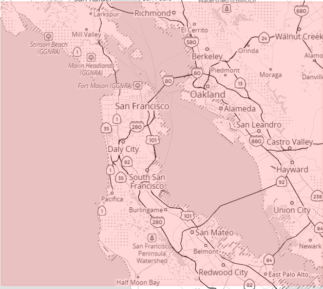

# P3-Wrangle-OpenStreetMap-Data
Udacity Data Analyst NanoDegree Project3 submission

This project involves studying the map-area below from https://mapzen.com/data/metro-extracts/metro/san-francisco_california/ provided by OpenStreetMaps. 
The objective of this project is to parse the data, clean up any values as needed, and upload the resulting values into MongoDB for further analysis.
I chose this data because I find the city of San Francisco fascinating. So, by studying the map data of San Francisco, I wanted to see if I can discover what makes up the character of this city.

All relevant files for this submission has been appended to github: https://github.com/pyarepiyush/P3-Wrangle-OpenStreetMap-Data/tree/master

Here are names of the files and their Descriptions:

**Capture.PNG** --> Screenshot of the map area selected

**Data cleanup with python and save JSON file.ipynb** --> iPython notebook with all codes for OSM data cleanup and upload into JSON format (Please note the content of this file has been broken down into python scripts below).

**P3 Wrangle OpenStreeMap data for San Francisco with MongoDB.ipynb** --> iPython notebook version of documentation of the assignment

**P3 Wrangle OpenStreeMap data for San Francisco with MongoDB.pdf** --> PDF version of documentation of the assignment

**Upload JSON to MongoDB.py** --> python script with code to upload JSON format into MongoDB

**generate osm sample file.py** --> python script to generate sample file (taken from course notes)

**osm data cleanup and upload as JSON.py** --> python script for OSM data cleanup and upload clean data into JSON format

**sf_sample.osm** --> sample file generated to test run the scripts

**study components of osm file.py** --> Code to study the components of OSM file, and find issues with the data